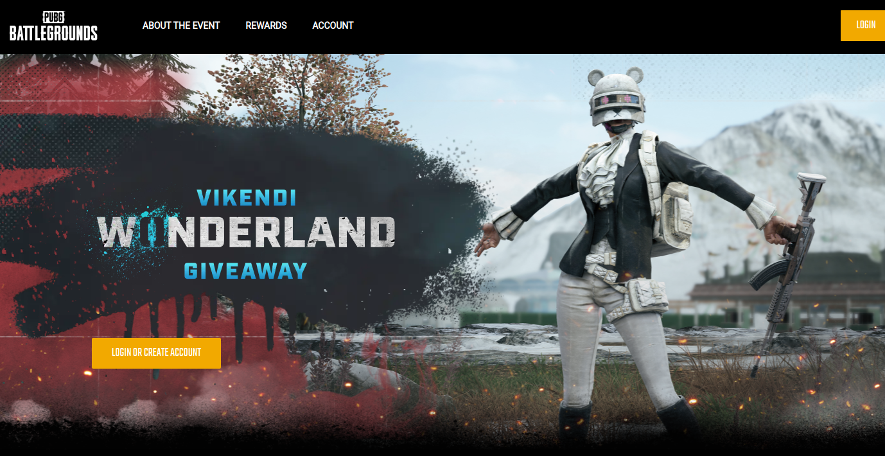

# Boas vindas ao repositório do projeto Game Frontend!

O deploy foi feito no Heroku. **<a href="https://game-frontend-9671.herokuapp.com/">Clique aqui</a>** para visualizar e testar a aplicação.

## Tecnologias e ferramentas utilizadas

`JavaScript`\
`CSS3`\
`HTML5`\
`media queries`\
`React.js`\
`Next.js`\
`eslint`\
`figma`

&nbsp;
## Sobre

Projeto desenvolvido individualmente como teste técnico para uma vaga na área de Front End. Todas as telas foram desenvolvidas por mim tomando como modelo um layout pré-definido no figma. Cada tela possui uma versão mobile (base 375px) e outra para web (base 1440px). Para obtenção desse design responsivo foi utilizado o conceito de **mobile first**.

A aplicação consiste em uma série de páginas com diversas informações e figuras sobre um evento de um jogo online. Veja uma amostra das versões da primeira tela abaixo.

Primeira página versão mobile:

Primeira página versão web:

&nbsp;
## Como rodar o projeto na sua máquina

Abra o seu Visual Studio Code, aperte ctrl + J para abrir um terminal e siga as instruções a seguir.

1. Clone o repositório na pasta desejada com o comando:\
`git clone git@github.com:camila-mp/game-front-end.git`

2. Entre na pasta clonada:\
`cd game-front-end`

3. Instale as dependências com:\
`npm install`

4. Inicialize a aplicação no modo de desenvolvimento no servidor local:\
`npm run dev`

5. Acesse 'http://localhost:3000' no navegador para visualizar a aplicação.
